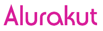
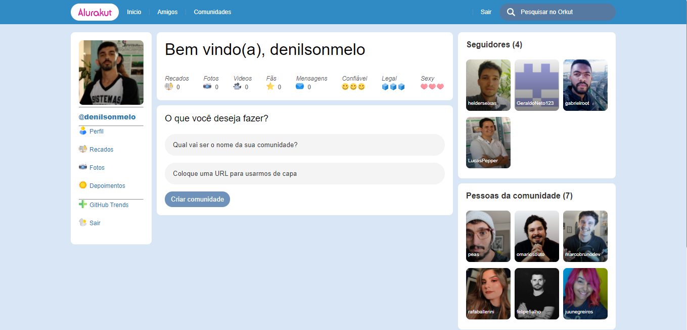

<p align="center">
  
</p>

<br>


<h1 align="center">
    
</h1>

<br>

## 💻 Tecnologias

Esse projeto foi desenvolvido usando as seguintes tecnologias:

- [ReactJS](https://reactjs.org)
- [NextJS](https://nextjs.org/)
- [styled-components](https://styled-components.com/)
- [DatoCMS](https://www.datocms.com/)


## 🚀 Iniciando

Clone o projeto e acesse a pasta.

```bash
$ git clone https://github.com/DenilsonMelo/alurakut.git
$ cd alurakut
```

Siga os passos:
```bash
# Instale as dependências
$ yarn

# Inicie o projeto
$ yarn start
```
O app pode ser acesado no seu browser em http://localhost:3000

<br>
<br>

```bash
# Melhorias futuras

- Adicionar dark mode
- Deixar funcional o botão Sair
- Criar página de comunidades
- Criar página de seguidores
- Criar página de pessoas da comunidade
```